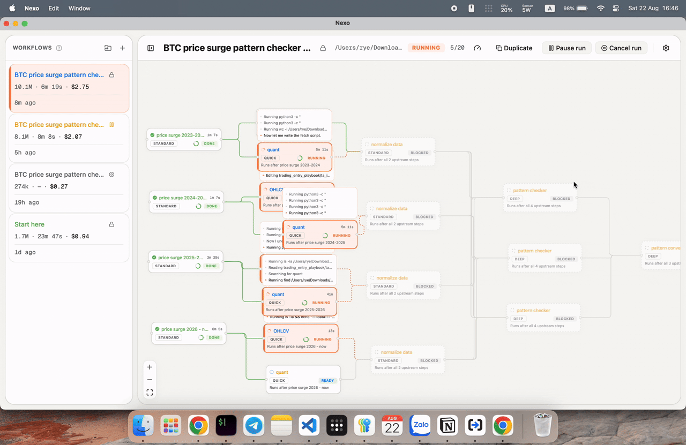

# Nexo - Nexo EXecution Orchestrator

**Streamlined, debuggable, retryable agentic workflow orchestration - that you can set up yourself.**

[](LICENSE)
[](go.mod)
[](#requirements)
[](https://github.com/rye-ndt/nexo/stargazers)



You draw the work as a graph. Each node is one scoped task: a role, a model, the
files it's allowed to touch, plus whatever guidance it needs. Nexo runs agents
through the graph, watches them, captures the diff, and feeds what each node
learned into the next node's prompt.

## Contents

- [Why Nexo exists](#why-nexo-exists)
- [Requirements](#requirements)
- [Quick start](#quick-start)
- [Config](#config)
- [Architecture](#architecture)
- [Driving Nexo from Claude Code](#driving-nexo-from-claude-code)
- [Support](#support)

## Why Nexo exists

The limitation of LLMs on long, multi-step work isn't the model, it's the
context. An agent that starts a task knowing only the task will improvise the
rest. So Nexo makes the handover between steps the thing you engineer.

Claude Code and OpenCode are great at one task, and Nexo runs on top of them
anyway. But:

- can you delegate a 10-step job, walk away, and trust it without reading every line?
- can you make it follow _your_ procedure instead of improvising one?
- can you see why it chose what it chose?
- can you undo step 4 and keep steps 1 through 3?

Four things separate it from a wrapper:

**Nodes are a DAG, not a queue.** Chaining is the entire point.

**The handover doc is the product.** A finished node writes down what it did,
what blocked it, what got approved, what got _rejected_, and what's still
broken. That doc becomes the next node's context. Telling the next agent what
**not** to do matters as much as telling it what happened.

**It assumes agents fail.** Every task write commits to SQLite as it happens, so
a crash costs you nothing already reported. Agents send heartbeats, and one that
goes quiet drops its task back into the pool. Every file change is stored as a
unified diff, so you can revert without depending on git.

**Agents never see your secrets.** Nexo does the OAuth once, encrypts the token,
and hands agents a placeholder. The proxy swaps in the real key on the way out,
and refuses anything aimed at an auth endpoint.

## Requirements

macOS (Windows is half-built and untested), Go 1.25+, Node 20+, and Wails:

```sh
go install github.com/wailsapp/wails/v2/cmd/wails@latest
```

Wails installs to `~/go/bin`, which might not be on your PATH. The Makefile
finds it either way.

## Quick start

```sh
git clone https://github.com/rye-ndt/nexo.git
cd nexo
make dev
```

Then, in the app:

1. install and sign in to Claude Code / Open Code in settings
2. authorize any MCP servers you need
3. start a session
4. make templates, each one a kind of agent that does a kind of work
5. drop nodes on the canvas and wire them together, mixing agent types freely
6. finalize the session, run it
7. go play pickleball
8. come back, review, revert what you don't like
9. commit

Two things that will bite you: `config.yaml` is compiled into the binary, so
editing it needs a rebuild rather than a restart. And use `make dev`, because
`go run .` dies on a Wails build tag.

## Config

`config.yaml` holds window size, timeouts, model lists, and the MCP servers you
can authorize.

**Change `encode_key` before you use this for real.** It encrypts your stored
OAuth tokens, and the default value is committed to this repo, so it isn't a
secret. Also: a typo anywhere in that file surfaces as a nil panic instead of a
readable error. Blame viper.

## Architecture

Hexagonal, and enforced. Ports live in `internal/interface/` and know no
technology. Each package under `internal/implementation/` is one technology,
depends only on `interface/`, and never on a sibling. `wire.go` is the only
composition root.

| Layer | Path | Holds |
| --- | --- | --- |
| Ports | `internal/interface/` | `core_itf`, `input_itf`, `output_itf` |
| Core | `internal/implementation/core/` | session manager, coordinator, agent manager, MCP proxy |
| Input | `internal/implementation/input/` | SQLite storage, agent harnesses, config, archives |
| Output | `internal/implementation/output/` | frontend API, logger, message queue |
| UI | `frontend/` | React, TypeScript, React Flow canvas |

Four collaborators drive a run:

- **SessionManager** owns graph state: tasks, dependencies, readiness, retries,
  accept gates, heartbeat deadlines. It does not know how to start an agent.
- **Coordinator** is the loop. It requests an agent per ready task, builds the
  prompt, and watches heartbeats. `buildPrompt` is where context engineering
  happens: task guidance, write allowance, and every dependency's handover doc.
- **AgentManager** owns instances on top of one harness per vendor, the things
  that spawn a subprocess and stream output.
- **MCPProxy** serves a local MCP server exposing `request_approval` and
  `report_task`. An agent calling `report_task` is the only way a node completes.

Working on it: `make dev`, `make build`, `make test`. In `frontend/`,
`npm run dev` serves vite on 8888 with no Wails runtime. Regenerate bindings
with `wails generate module` and never hand-edit `frontend/wailsjs/`.

## Driving Nexo from Claude Code

Nexo serves an MCP endpoint on a random port behind a token that changes every
launch, so a static HTTP registration would go stale daily. `cmd/nexo-mcp` is a
stdio server that reads the current port and token from the file the app writes
and forwards each call there. Register it once and it keeps working across
restarts.

```sh
make mcp-shim
claude mcp add nexo -- /full/path/to/nexo/build/bin/nexo-mcp
```

Use the absolute path, since Claude Code does not resolve it against your
project. Eight tools come across: list templates, create a session from one,
start, pause, cancel, read status, list sessions, and answer an acceptance gate.

The catch: **none of it works while the Nexo app is closed.** The shim only
forwards. Add `-launch` to have it open Nexo and wait, rather than failing the
call.

## Support

Questions and bugs go to [GitHub Issues](https://github.com/rye-ndt/nexo/issues).
Want help setting this up for your team, custom templates, or tuning it for your
company? Contact nduytung.1611@gmail.com.

Not vibe-coded: I built the backend and the architecture by hand. Claude helped
with the frontend.

Buy me a coffee:

- BTC `bc1q5kaek7dnkfah0h958ys4lzn574yu6lpu2tzwsr`
- EVM `0xeb8d8C405C4d377fcFB61FFF3b0Bb730B103A51f`
- SVM `rypBpVeH5HmMXKkMRHy3W4fWRhCUSPHsxD3hDy46QPG`

## License

[MIT](LICENSE), v0.0.1
